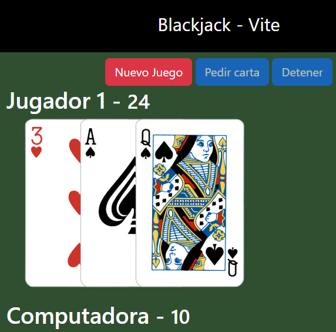

<h1 align="center">🃏 Blackjack Vite</h1>

<p align="center">
A modern Blackjack game built with Vite + JavaScript<br>
A fast, interactive interface focused on user experience
</p>

<p align="center">


</p>

<p align="center">
  <a href="https://gcv-blackjack-vite.netlify.app/">
    
  </a>
</p>

---

## 🎮 Description

**Blackjack Vite** is an implementation of the classic card game, Blackjack, developed using Vite to ensure fast performance and a fluid user experience. The goal of the game is simple:
- Get as close as possible to 21 without going over
- Beat the dealer's hand
- Balance strategy and chance

---

## 📸 Preview

<p align="center">

</p>

---

## ⚙️ Installation

Clone the repository:

```bash
git clone https://github.com/gcondezav/blackjack-vite
cd blackjack-vite
```

Install dependencies:

```bash
npm install
```

Run the project:

```bash
npm run dev
```

---

## 🧩 Technologies Used

- Vite
- JavaScript
- HTML5
- CSS3

---

## 📁 Project Structure

```bash
blackjack-vite/
│
├── src/
│   ├── assets/
│   ├── game/
│   ├── main.js
│   └── style.css
│
├── index.html
├── package.json
└── vite.config.js
```

---

## 👨‍💻 Author

Developed by Gabriel Condeza

<p align="center">
⭐ If you liked this project, consider giving the repository a star
</p>
